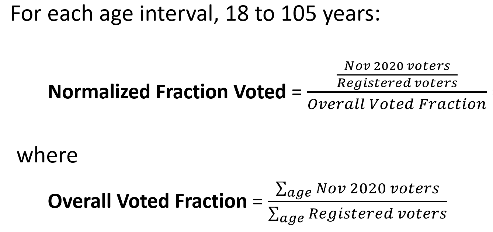
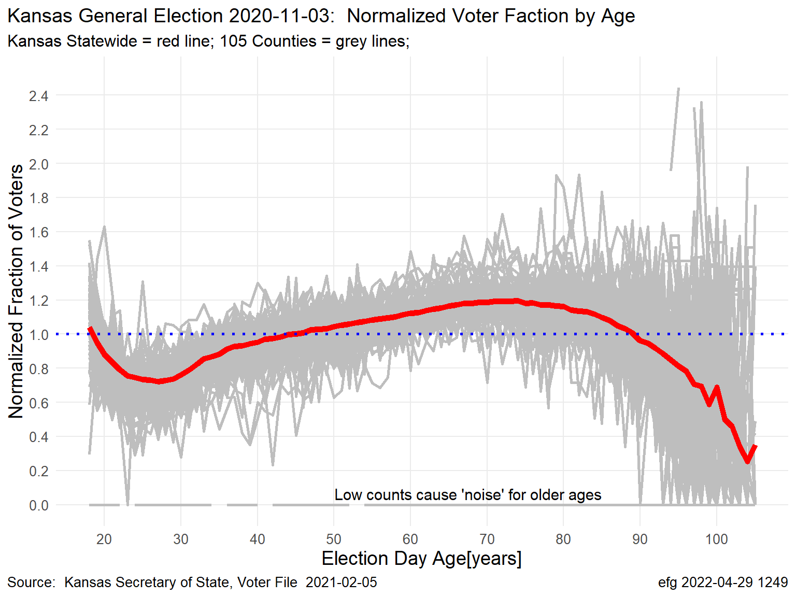
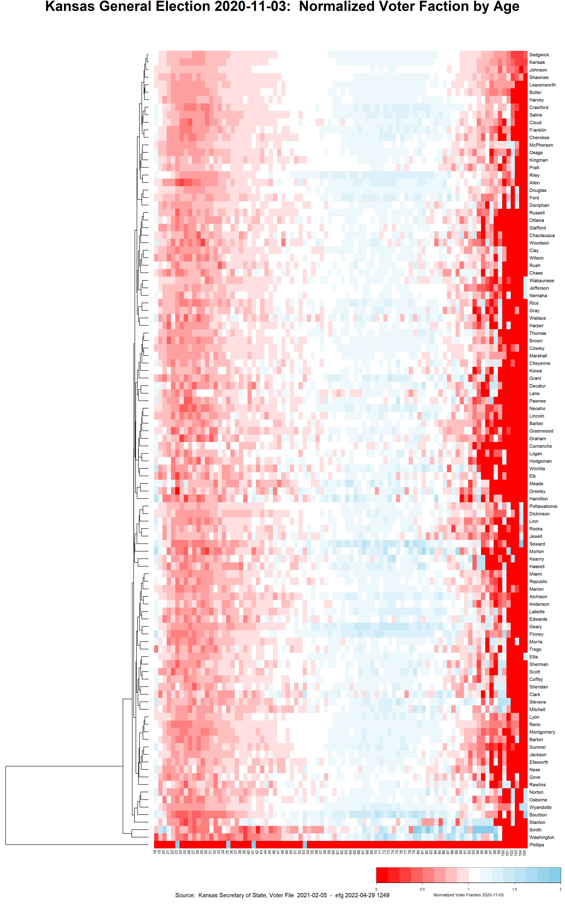
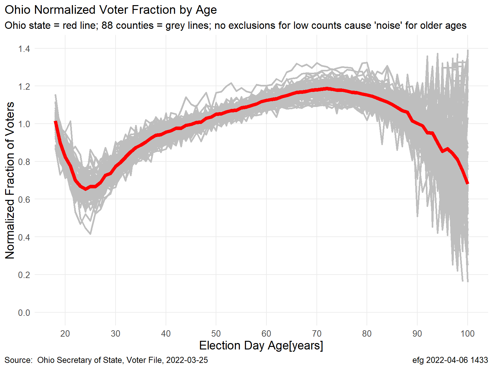
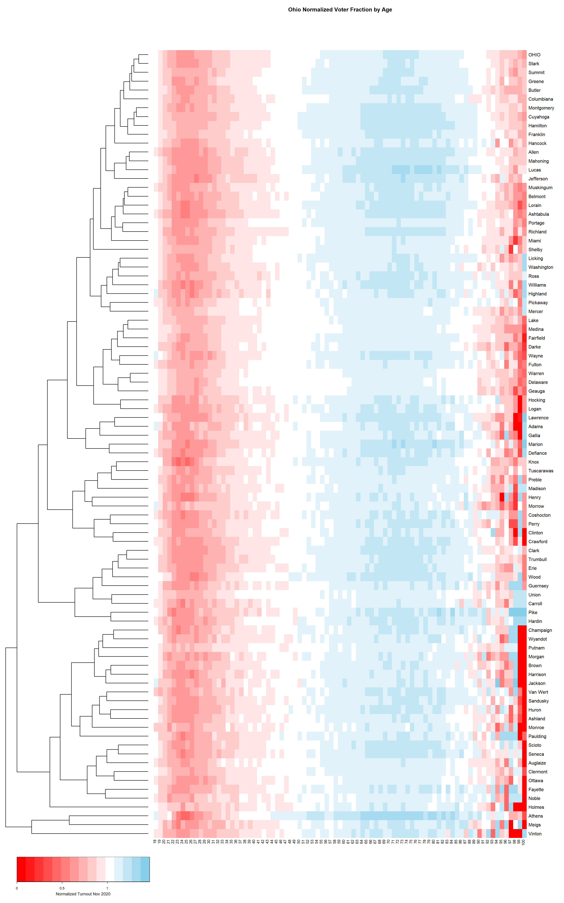

# Normalized Election Turnout Nov. 2020 and Earlier Years

* Kansas

* Ohio

Advantages of Normalized Turnout by Age

* Ratios > 1 show age ranges with turnout better than overall turnout

* Ratios < 1 show age ranges with turnout worse than overall turnout

* Turnout curves can be compared among state, counties, and precincts.

## Kansas

PowerPoints

* Kansas-2020-November-General.pptx

* Kansas-2006-2020-November-General-Normalized-Voter-Turnout.pptx

* Kansas-2020-August-Primary.pptx

* Kansas-2006-2020-August-Primary-Normalized-Voter-Turnout.pptx

## Ohio

PowerPoint

* Ohio-Election-Analysis-Nov-2020.pptx

